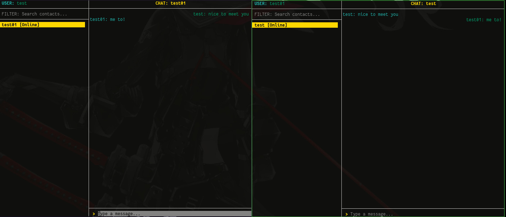

<p align="center">
  
</p>

<h1 align="center">cim</h1>

<p align="center">
  Command Instant Messenger，一款运行在终端中的实时即时通讯工具。
</p>



## 主要功能

- **账号审核与登录**：新账号需要管理员批准后才能登录，密码不会以明文保存。
- **一对一实时聊天**：选择联系人后即可发送消息，双方在线时消息会实时送达。
- **消息时间标记**：每条消息上方显示服务端确认的发送日期和时间。
- **在线状态同步**：联系人列表会显示用户当前处于在线或离线状态。
- **服务器连接设置**：可在客户端配置服务器的 IP、域名和端口，保存后自动重新连接。
- **联系人搜索**：通过用户名快速筛选联系人。
- **双栏聊天界面**：左侧管理联系人，右侧集中展示当前会话和消息输入框。
- **键盘优先操作**：支持方向键切换区域和联系人，按 Enter 发送消息。
- **自动重新连接**：网络连接中断后会自动尝试恢复，并在当前运行周期内恢复登录会话。
- **发送状态提示**：连接异常、认证失败、空消息和发送失败会在界面中显示提示。
- **本机服务管理**：服务端提供受密钥保护的本机命令，可审核注册、查看用户、修改密码和删除账号。

## 构建

构建 cim 需要：

- Git
- CMake 3.21 或更高版本
- 支持 C++20 的编译器
- SQLite3
- libsodium

获取源码后，先初始化项目依赖：

```bash
git submodule update --init --recursive
```

### Linux

Debian / Ubuntu 可以通过以下命令安装构建环境：

```bash
sudo apt update
sudo apt install build-essential cmake git libsqlite3-dev libsodium-dev
```

配置并构建：

```bash
cmake -B build -S .
cmake --build build --target all
```

构建产物位于：

```text
build/cim
build/cim-server
```

### Windows

Windows 需要 Visual Studio 2022 的“使用 C++ 的桌面开发”组件，并使用
[vcpkg](https://github.com/microsoft/vcpkg) 安装系统依赖：

```powershell
C:\vcpkg\vcpkg.exe install sqlite3:x64-windows libsodium:x64-windows
```

通过 vcpkg 工具链配置并构建 Release 版本：

```powershell
cmake -B build -S . -A x64 `
  -DCMAKE_TOOLCHAIN_FILE=C:/vcpkg/scripts/buildsystems/vcpkg.cmake
cmake --build build --config Release --target all
```

构建产物位于：

```text
build/Release/cim.exe
build/Release/cim-server.exe
```

> Linux 构建已经验证。Windows 构建配置已适配 vcpkg，但尚未在 MSVC 环境中实际验证。

## 服务端管理

管理命令要求 `cim-server` 正在运行，并且必须在启动服务端时使用的同一工作目录执行。服务端首次启动时会在该目录生成 `cim-admin.key`，管理通道仅监听 `127.0.0.1:9002`。

查看待审核注册申请：

```bash
./build/cim-server pending
```

批准注册申请：

```bash
./build/cim-server approve <username>
```

拒绝注册申请：

```bash
./build/cim-server reject <username>
```

拒绝时需要先输入用户名确认，再填写不能为空的拒绝原因。拒绝原因会持久保存，因此客户端离线或服务端重启后仍能显示；同名用户重新申请时会清除旧原因。

客户端提交注册后不会立即登录。`cim` 保持运行时会立即收到批准或拒绝通知，网络短暂重连后也会继续监听审核结果。申请被批准后，用户需要使用注册时填写的密码手动登录；被拒绝后可以重新提交申请。待审核申请保留 7 天，服务端最多同时保存 1000 条申请。

列出注册用户、创建时间和实时在线状态：

```bash
./build/cim-server users
```

修改用户密码：

```bash
./build/cim-server passwd <username>
```

新密码会通过隐藏输入读取。修改成功后，该用户的历史会话将失效，在线连接也会立即断开。

删除用户：

```bash
./build/cim-server delete <username>
```

删除前需要再次输入用户名确认。用户被删除后，其历史会话将一并清除，在线连接也会立即断开。

查看管理命令帮助：

```bash
./build/cim-server help
```

## 使用体验

1. 打开 cim 后，可以通过 `Server settings` 配置服务器地址和端口。
2. 选择登录或提交账号注册申请；新账号需要等待服务端管理员批准。
3. 登录成功后，从左侧联系人列表选择聊天对象。
4. 在右侧输入消息，按 Enter 发送。
5. 使用左右方向键在联系人区域和聊天区域之间切换。
6. 使用搜索框快速定位联系人，并通过在线状态判断对方是否可以即时接收消息。

## 当前范围

- 目前支持在线用户之间的一对一实时消息。
- 聊天消息不会保存为历史记录。
- 对方离线时不会保存或补发消息。
- 群聊、文件传输、图片消息和消息撤回尚未提供。
